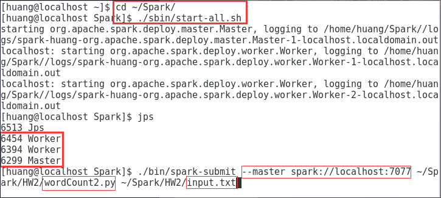
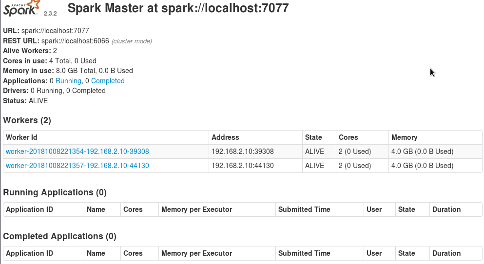
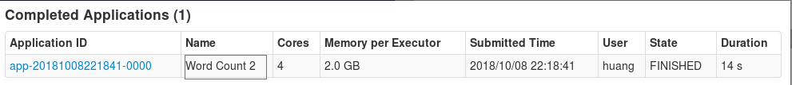
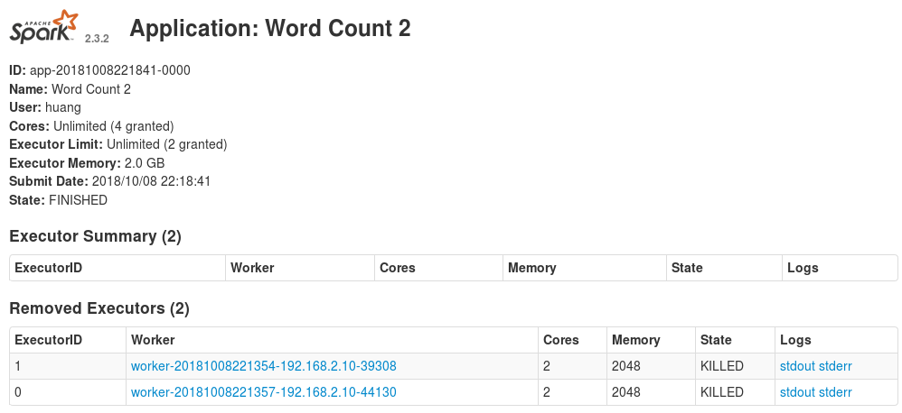
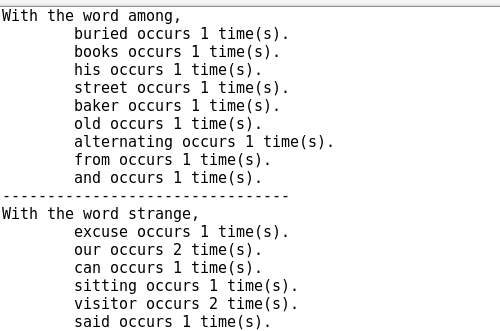

#WordCount2

## 1. Spark configuration
### 1.1 Configure Environment
1.1.1 Edit .bashrc  
$ vi ~/.bashrc
```
#JAVA ENV
export JAVA_HOME=~/Java
export JRE_HOME=$JAVA_HOME/jre
export CLASSPATH=.:$CLASSPATH:$JAVA_HOME/lib:JRE_HOME/lib
export PATH=$PATH:$JAVA_HOME/bin:$JRE_HOME/bin

#Hadoop ENV
export HADOOP_HOME=~/Hadoop
export HADOOP_INSTALL=$HADOOP_HOME
export HADOOP_MAPRED_HOME=$HADOOP_HOME
export HADOOP_COMMON_HOME=$HADOOP_HOME
export HADOOP_HDFS_HOME=$HADOOP_HOME
export YARN_HOME=$HADOOP_HOME
export PATH=$PATH:$HADOOP_HOME/sbin:$HADOOP_HOME/bin
export HADOOP_COMMON_LIB_NATIVE_DIR=$HADOOP_HOME/lib/native

#Sprak ENV
export SPARK_HOME=~/Spark/
export PATH=$PATH:$SPARK_HOME/bin
```
source ~/.bashrc  

1.1.2 Edit spark-env.sh  
$ cd ~/Spark/conf/  
$ cp spark-env.sh.template spark-env.sh  
$ vi spark-env.sh
```
export SPARK_WORKER_CORES=2
export SPARK_WORKER_MEMORY=4g
export SPARK_WORKER_INSTANCES=2
export SPARK_EXECUTOR_MEMORY=2g
export SPARK_DRIVE_MEMORY=2g
```
***
### 1.2 Edit host file
$ sudo vi /etc/hosts  
>127.0.0.1  namenode

***
### 1.3 Edit core-site.xml
$ cd ~/Hadoop/etc/hadoop/  
$ vi core-site.xml
```
<property>
    <name>fs.defaultFS</name>
    <value>hdfs://namenode:9000</value>
</property>
```

***
### 1.4 Edit hdfs-site.xml
$ vi hdfs-site.xml
```
<property>
    <name>dfs.replication</name>
    <value>1</value>
</property>
<property>
    <name>dfs.name.dir</name>
    <value>/home/huang/data/namenode</value>
</property>
<property>
    <name>dfs.data.dir</name>
    <value>/home/huang/data/datanode</value>
</property>
<property>
    <name>dfs.namenode.secondary.http-address</name>
    <value>namenode:50090</value>
</property>
<property>
    <name>dfs.webhdfs.enabled</name>
    <value>true</value>
</property>
```

***
### 1.5 Edit mapred-site.xml
$ cp mapred-site.xml.template mapred-site.xml  
$ vi mapred-site.xml
```
<property>
    <name>fs.defaultFS</name>
    <value>hdfs://namenode:9000</value>
</property>
```

***
### 1.6 Edit yarn-site.xml
$ vi yarn-site.xml
```
<property>
    <name>yarn.nodemanager.aux-services</name>
    <value>mapreduce_shuffle</value>
</property>
<property>
    <name>yarn.nodemanager.resource.memory-mb</name>
    <value>9124</value>
</property>
<property>
    <name>yarn.nodemanager.resource.cpu-vcores</name>
    <value>4</value>
</property>
```

***
### 1.7 Edit slave
$ vi slaves
>localhost  


***
## 2. Write wordCount2.py Code
```python  
from pyspark import SparkContext
import re, sys

# define a function which convert lines to word pairs
def line2wordsPair(line):
	# use regular expression to find all symbols which are not included in alphabet
    symbols = re.compile(r'[^\w\ ]|[\d]')
	# remove the symbols and transfer the string to lower-case
    cleanLine = symbols.sub("",line).lower()
	# using space to split the new line to words
    words = cleanLine.split()
	# set a list to store the words which have been counted
    temp=[]
	# set a list to store the word pairs
    keyPairs=[]
	### The following for loops could be optimized to while loops which could delet the words has been mapped
	### However, this method may need us to change the index of iterator which makes the code looks a little mess
	### Moreover, the number of words in each line is not too much, so it won't bring too much extra computation
	# use for loop to map each word in the line
    for word1 in words:
		# ignore the word which has been mapped
        if word1 not in temp:
			# find other words in the line
            for word2 in words:
				# ignore the same word
                if word2 != word1:
					# ignore the word which has been mapped
                    if word2 not in temp:
						# creat two tuples to store the word pairs. eg: (a,b) and (b,a)
                        key1 = (word1, word2)
                        key2 = (word2, word1)
					    # append the key pairs to the list
                        keyPairs.append(key1)
                        keyPairs.append(key2)
		# remember the word which has been mapped
        temp.append(word1)
    return keyPairs

# define a function to save the result in a file with a format compose
def printResult(result):
	# open the file
    f= open("/home/huang/Spark/HW2/result.txt","w")
	# get the lenth of the result list
    length = len(result)
	# excute the following code while length is not 0
    while length:
		# get the firt element of the list
        each = result[0]
		# write the information of the element to the file
        f.write("With the word {},\n".format(each[0][0]))
        f.write ("\t{} occurs {} time(s).\n".format(each[0][1], each[1]))
		# remove the element which has been used
        result.remove(result[0])
        length -= 1
		# find other element which has the same word as the first word of word pair
        index=0
        while index< length:
            other = result[index]
			# only need the element which has the same head word
            if other[0][0]==each[0][0]:
                f.write ("\t{} occurs {} time(s).\n".format(other[0][1], other[1]))
				# remove the fitted element 
                result.remove(other)
                index -= 1
                length -= 1
            index +=1  
        f.write("--------------------------------\n")
    f.close()   

# set the master addres and Application name
sc = sc = SparkContext("spark://localhost:7077","Word Count 2")
# load the file
textfile = sc.textFile(sys.argv[1])
# get the the output
wordCounts = textfile.flatMap(line2wordsPair).map(lambda pair: (pair,1)).reduceByKey(lambda a,b:a+b)
results = wordCounts.collect()
# print the result to file
printResult(results)
```


***
## 3. Start the Spark Cluster
At first, uplode the wordCount2.py and *input.txt* to ~/Spark/HW2


Then, launch the Spark services

  
Here is the Spark web UI

  
After we excute the **word count** command, an application has been created.
  
  

Finally, we got the result.

  
